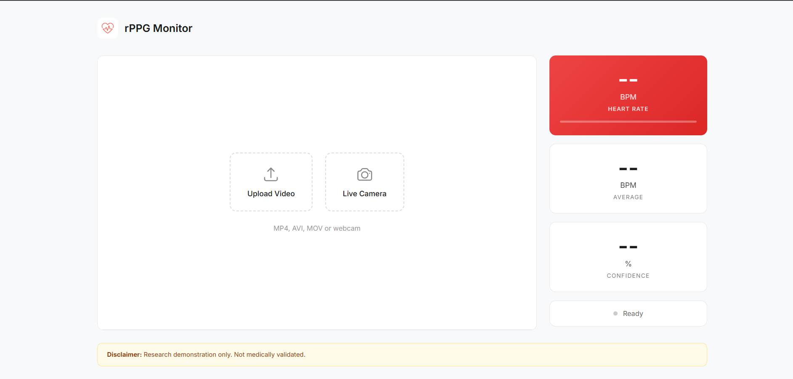
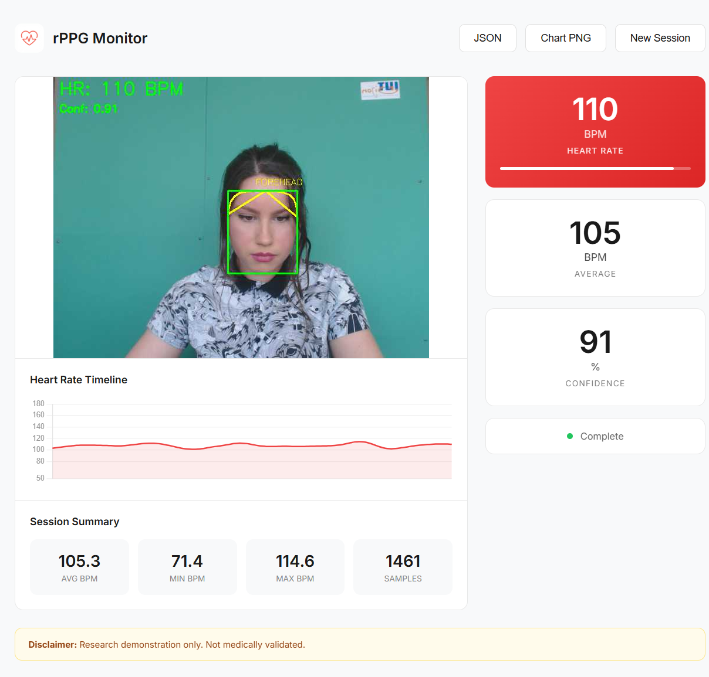
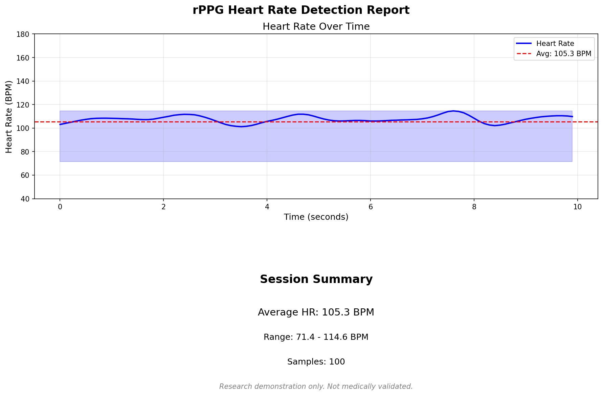

<p align="center">
  
</p>

# rPPG: Remote Photoplethysmography for Contactless Heart Rate Detection

<p align="center">
  <em>Contactless heart rate detection using computer vision and deep learning</em>
</p>

---

Remote Photoplethysmography (rPPG) is a technique for measuring blood volume changes in the microvascular bed of tissue using a standard camera. This repository implements a production-grade rPPG system combining classical signal processing methods with deep learning for accurate, contactless heart rate estimation.

## Table of Contents

- [Overview](#overview)
- [Motivation](#motivation)
- [Applications](#applications)
- [Features](#features)
- [Installation](#installation)
- [Usage](#usage)
- [Architecture](#architecture)
- [Algorithms](#algorithms)
- [Training](#training)
- [Results](#results)
- [Project Structure](#project-structure)
- [Dataset](#dataset)
- [References](#references)
- [License](#license)

## Overview

This project provides a complete pipeline for extracting physiological signals from facial video recordings. The system detects subtle color variations in skin caused by blood flow during the cardiac cycle, processes these signals to isolate the pulse waveform, and estimates heart rate in beats per minute (BPM).

### Key Capabilities

- Real-time heart rate estimation from webcam or video files
- Multiple signal extraction methods (CHROM, POS, PhysNet)
- Web-based dashboard with live visualization
- ONNX model export for optimized deployment
- Confidence scoring for signal quality assessment

## Motivation

Traditional heart rate monitoring requires physical contact with sensors, wearables, or medical equipment. This creates barriers in several scenarios:

- **Accessibility**: Not everyone has access to medical-grade pulse oximeters
- **Comfort**: Continuous wearable monitoring can be uncomfortable
- **Hygiene**: Contact-based sensors in hospitals require frequent sanitization
- **Cost**: Medical monitoring equipment is expensive

This project explores how computer vision and deep learning can democratize health monitoring by using just a camera—available on every smartphone, laptop, and webcam.

## Applications

### Healthcare and Telemedicine

| Application | Description |
|-------------|-------------|
| **Remote Patient Monitoring** | Monitor vital signs during video consultations without specialized equipment |
| **Neonatal ICU** | Non-invasive monitoring of premature infants where contact sensors are problematic |
| **Elderly Care** | Ambient monitoring in assisted living facilities without wearables |
| **Mental Health** | Track physiological stress indicators during therapy sessions |

### Fitness and Wellness

| Application | Description |
|-------------|-------------|
| **Smart Mirrors** | Display heart rate during workouts without wearing sensors |
| **Meditation Apps** | Track heart rate variability for stress and relaxation feedback |
| **Sleep Studies** | Non-contact monitoring during sleep without uncomfortable sensors |

### Human-Computer Interaction

| Application | Description |
|-------------|-------------|
| **Driver Monitoring** | Detect drowsiness and stress levels while driving |
| **Gaming** | Adaptive gameplay based on player's physiological state |
| **Video Conferencing** | Real-time wellness indicators during meetings |
| **Lie Detection** | Research applications in detecting physiological stress |

### Research and Education

| Application | Description |
|-------------|-------------|
| **Affective Computing** | Study emotions and their physiological manifestations |
| **Sports Science** | Non-invasive performance monitoring during training |
| **Psychology Studies** | Measure arousal without disrupting natural behavior |
| **Teaching Tool** | Demonstrate signal processing and computer vision concepts |

### Security and Surveillance

| Application | Description |
|-------------|-------------|
| **Authentication** | Liveness detection using pulse presence as anti-spoofing |
| **Crowd Monitoring** | Mass screening for fever or stress in public spaces |

## Features

| Feature | Description |
|---------|-------------|
| **PhysNet 3D-CNN** | End-to-end deep learning model for rPPG signal extraction |
| **CHROM Method** | Chrominance-based signal processing (De Haan & Jeanne, 2013) |
| **POS Method** | Plane-orthogonal-to-skin projection (Wang et al., 2017) |
| **Real-time Dashboard** | FastAPI backend with WebSocket streaming |
| **ONNX Support** | Model export for cross-platform deployment |
| **Signal Quality** | SNR-based confidence estimation |

## Installation

### Prerequisites

- Python 3.10 or higher
- CUDA 11.8+ (optional, for GPU acceleration)
- Git

### Setup

```bash
# Clone the repository
git clone https://github.com/HarshTomar1234/rppg-heart-rate.git
cd rppg-heart-rate

# Create and activate virtual environment
python -m venv venv
.\venv\Scripts\activate      # Windows
source venv/bin/activate     # Linux/macOS

# Install dependencies
pip install -r requirements.txt
```

### GPU Support (Optional)

For CUDA-accelerated training and inference:

```bash
pip install torch torchvision --index-url https://download.pytorch.org/whl/cu118
```

## Usage

### Web Dashboard

Launch the real-time monitoring dashboard:

```bash
python -m uvicorn src.app.main:app --host 127.0.0.1 --port 8000
```

Navigate to `http://localhost:8000` in your browser, then upload a video file for analysis.

### Command-Line Demo

Process a video file directly:

```bash
python demo_video.py path/to/video.mp4 --method chrom --no-preview
```

Options:
- `--method`: Signal extraction method (`chrom`, `pos`, `auto`)
- `--no-preview`: Disable real-time display (headless mode)

### Python API

```python
from src.vitals import HeartRateMonitor
import cv2

# Initialize monitor
monitor = HeartRateMonitor(fps=30.0, method='chrom')

# Process video
cap = cv2.VideoCapture('video.mp4')
while cap.isOpened():
    ret, frame = cap.read()
    if not ret:
        break
    
    result = monitor.process_frame(frame)
    print(f"Heart Rate: {result['heart_rate']:.1f} BPM")
```

## Architecture

```
Input Video --> Face Detection --> ROI Extraction --> Signal Processing --> FFT --> Heart Rate
     |              |                   |                    |               |          |
  Frames    MediaPipe Face Mesh   Forehead+Cheeks       CHROM/POS/green    Peak      BPM
```

### Processing Pipeline

1. **Face Detection**: MediaPipe Face Mesh (478 landmarks) localizes the face and
   forehead/cheek regions; a legacy Haar Cascade detector also exists in
   `src/detection/face_detector.py` but is not used by the live pipeline
2. **ROI Extraction**: Multi-region (forehead + both cheeks) fusion for a more
   robust signal with redundancy
3. **Signal Extraction**: RGB temporal traces converted to a pulse signal via CHROM,
   POS, green-channel, or confidence-based auto-selection between them (see
   [Results](#results) for measured accuracy of each)
4. **Bandpass Filtering**: 0.7-3.0 Hz filter isolates cardiac frequencies (42-180 BPM)
5. **Spectral Analysis**: FFT identifies dominant frequency component
6. **Heart Rate Estimation**: Peak frequency converted to BPM, then Kalman-smoothed
   with confidence scoring

PhysNet (a 3D-CNN, `src/models/physnet.py`) is trained and evaluated (see
[Results](#results)) but is **not yet wired into this live pipeline** — the app
always uses CHROM/POS/green/auto. Integrating a trained checkpoint into the runtime
is tracked as later production-readiness work.

## Algorithms

### CHROM (Chrominance-based)

The CHROM method builds two orthogonal chrominance signals from normalized RGB values:

```
Xs = 3*Rn - 2*Gn
Ys = 1.5*Rn + Gn - 1.5*Bn
Pulse = Xs - (std(Xs)/std(Ys)) * Ys
```

Reference: De Haan, G., & Jeanne, V. (2013). Robust pulse rate from chrominance-based rPPG. IEEE Transactions on Biomedical Engineering.

### POS (Plane-Orthogonal-to-Skin)

The POS method projects normalized RGB signals onto a plane orthogonal to the skin-tone direction:

```
Xs = Gn - Bn
Ys = -2*Rn + Gn + Bn
Pulse = Xs + (std(Xs)/std(Ys)) * Ys
```

Reference: Wang, W., et al. (2017). Algorithmic principles of remote PPG. IEEE Transactions on Biomedical Engineering.

### PhysNet

PhysNet is a 3D Convolutional Neural Network that learns spatio-temporal features directly from video frames:

- **Input**: Video clip (T × H × W × 3)
- **Architecture**: 3D convolution blocks with batch normalization
- **Output**: Reconstructed rPPG signal (T samples)
- **Loss Function**: Negative Pearson correlation

Reference: Yu, Z., et al. (2019). Remote heart rate measurement from highly compressed facial videos.

## Training

### Evaluate the classical pipeline (no training required)

CHROM/POS/green/auto are deterministic signal processing — nothing to train. This
runs the exact production pipeline against real UBFC-rPPG ground truth and reports
honest, uncertainty-bounded accuracy:

```bash
python scripts/evaluate_classical.py --dataset datasets --output results/phase1
```

### Train PhysNet with Leave-One-Subject-Out cross-validation

```bash
python scripts/train_ubfc.py --dataset datasets --output results/phase1/physnet_loso
python scripts/train_ubfc.py --smoke-test   # 1 fold, 2 epochs, fast sanity check
```

Every trainable subject is held out exactly once, trained on all others, and never
appears in its own training set — this replaced an earlier version that split at the
*clip* level, which let overlapping clips from the same subject leak across the
train/val boundary and inflate validation accuracy. See
[Results](#results) below for why this matters and what it changed.

Options: `--epochs`, `--batch-size`, `--lr`, `--grad-accum-steps`, `--weight-decay`,
`--early-stop-patience`, `--held-out <subject_ids>` (run a subset of folds). The run
is resumable: re-running the same command skips folds already recorded in
`loso_summary.json`.

### Training output

- `results/<output>/checkpoints/physnet_loso_<subject_id>.pth` — one checkpoint per fold
- `results/<output>/loso_summary.json` — per-fold MAE/RMSE/Pearson r + aggregate stats

## Results

### Demo Screenshots

#### Application Interface


#### Heart Rate Detection in Action


#### Session Report Chart


### Methodology

Evaluated against **15 real UBFC-rPPG subjects** (all 8 from Dataset-1, 7 from
Dataset-2) — every subject with both a video and real ground-truth PPG currently
downloaded. Ground truth is computed by applying the *same* 6-second windowed-FFT
procedure to the raw PPG waveform that's applied to the extracted rPPG signal, so
both sides of the comparison are methodologically symmetric (not compared against the
pulse oximeter's own precomputed HR channel, which has unknown internal smoothing).

Two tiers of metrics are reported and never blended: **per-subject** (N=15 — the only
tier that supports an inferential claim, e.g. a confidence interval) and **per-window**
(965 pooled 6s windows — descriptive only, since windows within a subject overlap 5 of
every 6 seconds and share subject-level confounds like skin tone and lighting).

Full methodology, statistical reasoning, and reviewed-by-an-ML-specialist design
decisions are in `specs/phase-1.md` (local working notes, not tracked in this repo).

### Classical pipeline (CHROM / POS / green / auto) — no training required

| Method | Per-subject MAE (N=15) | 95% CI (bootstrap) | Bland-Altman bias / SD | % windows within ±5 BPM |
|---|---|---|---|---|
| CHROM | 1.77 ± 1.17 BPM | [1.25, 2.38] | -0.21 / 4.32 | 95.9% |
| **POS** | **1.57 ± 1.07 BPM** | [1.09, 2.14] | -0.17 / 4.07 | 96.2% |
| Green channel (naive floor) | 4.74 ± 2.85 BPM | [3.39, 6.17] | +0.50 / 9.50 | 78.8% |
| **Auto (POS/CHROM/green, confidence-selected)** | **1.57 ± 1.02 BPM** | [1.11, 2.09] | -0.21 / 3.92 | 96.5% |

- **CHROM vs POS**: paired Wilcoxon signed-rank test (N=15) gives p=0.09 — **not
  statistically distinguishable at this sample size** (not claimed as "equivalent").
- **Auto-mode method selection**: POS chosen 57% of windows, CHROM 39%, green 4% — no
  method is ever silently unused.
- **Confidence calibration**: verified monotonic — mean error drops from ~8.4 BPM in
  the lowest confidence decile to ~1.0 BPM in the highest, confirming the app's
  confidence score is a real quality signal, not decoration.
- **Kalman-smoothing check**: smoothed-vs-ground-truth variance ratio is ~1.1-1.2x
  (not <1), meaning the Kalman filter is *not* artificially flattering accuracy by
  suppressing genuine heart-rate variability — a specific failure mode we checked for
  and did not find.

### PhysNet (3D-CNN, Leave-One-Subject-Out cross-validation)

| Metric | Value |
|---|---|
| Subjects (folds) | 15 |
| Mean MAE | 31.4 ± 16.6 BPM |
| 95% CI (bootstrap) | [24.2, 40.8] |
| Median MAE | 27.7 BPM |
| Range | 15.4 – 84.0 BPM |

**Honest framing**: this is substantially worse than the classical pipeline above,
and that is an expected, not a surprising, result. A 3D-CNN trained from scratch on
only 14 subjects per fold does not have enough data diversity to learn a
generalizable pulse signal — published PhysNet-class results typically pretrain on
much larger multi-dataset corpora before fine-tuning. This training run demonstrates
that the *pipeline* works correctly end-to-end (subject-level LOSO splitting with no
leakage, NegPearson-loss training, checkpointing, clip-stitching inference, and
windowed-FFT extraction) — it is **not** presented as a production-ready model, and
CHROM/POS/auto remain what the live app actually uses.

### What this validation does NOT show

- No cross-skin-tone or cross-lighting generalization claim — UBFC-rPPG is a single
  lab setup with a narrow demographic.
- No clinical or diagnostic validity claim — ground truth is consumer pulse-oximeter
  PPG, not ECG.
- No claim of robustness to other cameras, webcams, or video compression.
- No claim of motion robustness beyond UBFC-2's mild task protocol.
- No comparison to published SOTA benchmark tables (different N and protocol).

> **Note**: See [LIMITATIONS.md](LIMITATIONS.md) for the full limitations list.


## Project Structure

```
rppg-heart-rate/
├── src/
│   ├── detection/          # Face detection and ROI extraction
│   │   ├── face_detector.py
│   │   └── roi_extractor.py
│   ├── processing/         # Signal processing algorithms
│   │   ├── filters.py      # CHROM, POS, bandpass filtering
│   │   └── fft_analyzer.py # Spectral analysis
│   ├── vitals/             # Heart rate estimation pipeline
│   │   └── heart_rate.py
│   ├── models/             # Deep learning architectures
│   │   └── physnet.py      # PhysNet 3D-CNN
│   ├── data/               # Dataset loaders
│   │   └── ubfc_loader.py
│   └── app/                # Web application
│       ├── main.py         # FastAPI backend
│       └── static/         # Frontend assets
├── scripts/
│   ├── train_ubfc.py       # Training script
│   └── test_physnet.py     # Testing and evaluation
├── models/                 # Trained model weights
├── requirements.txt
├── demo_video.py
├── LICENSE
└── README.md
```

## Dataset

This project uses the UBFC-rPPG dataset for training and validation.

### Citation

If you use the UBFC-rPPG dataset, please cite:

```bibtex
@article{bobbia2019unsupervised,
  title={Unsupervised skin tissue segmentation for remote photoplethysmography},
  author={Bobbia, S. and Macwan, R. and Benezeth, Y. and Mansouri, A. and Dubois, J.},
  journal={Pattern Recognition Letters},
  volume={124},
  pages={82--90},
  year={2019},
  publisher={Elsevier}
}
```

Dataset available at: https://sites.google.com/view/ybenezeth/ubfcrppg

### Dataset Structure

```
datasets/
├── DATASET_1/
│   ├── subject1/
│   │   ├── vid.avi           # Video recording
│   │   └── gtdump.xmp        # Ground truth (timestamp, HR, SpO2, PPG)
│   └── ...
└── DATASET_2/
    ├── subject1/
    │   ├── vid.avi
    │   └── ground_truth.txt  # Ground truth (PPG, HR, timestamp)
    └── ...
```

## References

1. De Haan, G., & Jeanne, V. (2013). Robust pulse rate from chrominance-based rPPG. *IEEE Transactions on Biomedical Engineering*, 60(10), 2878-2886.

2. Wang, W., den Brinker, A. C., Stuijk, S., & de Haan, G. (2017). Algorithmic principles of remote PPG. *IEEE Transactions on Biomedical Engineering*, 64(7), 1479-1491.

3. Yu, Z., Li, X., & Zhao, G. (2019). Remote photoplethysmograph signal measurement from facial videos using spatio-temporal networks. *BMVC*.

4. Bobbia, S., Macwan, R., Benezeth, Y., Mansouri, A., & Dubois, J. (2019). Unsupervised skin tissue segmentation for remote photoplethysmography. *Pattern Recognition Letters*, 124, 82-90.

## Disclaimer

This software is provided for research and educational purposes only. Heart rate measurements from this system are **not medically validated** and should **not be used for clinical diagnosis or medical decision-making**. For accurate health monitoring, use FDA-approved medical devices.

## License

Copyright 2026 Harsh Tomar

Licensed under the Apache License, Version 2.0. See [LICENSE](LICENSE) for details.

## Author

**Harsh Tomar**  
AI/ML Developer  
https://kernel-crush.netlify.app/
